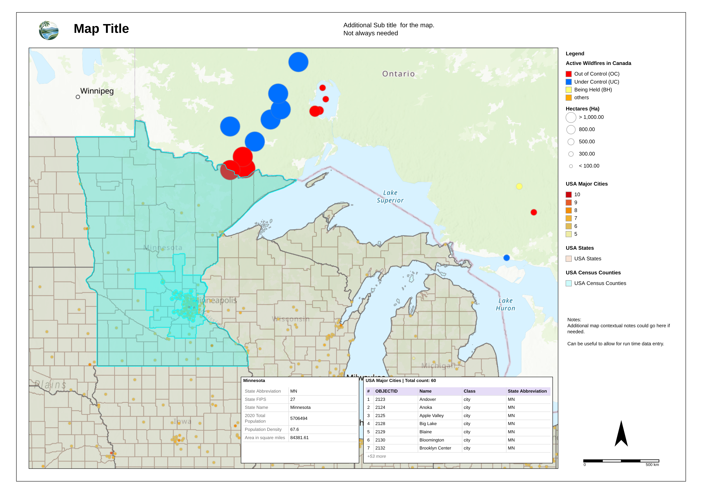

# Print / Export widget

A custom [ArcGIS Experience Builder](https://developers.arcgis.com/experience-builder/) widget that lets app designers build print/export layout templates — title, logo, legend, scale bar, north arrow, attribute table, feature popup card, and more, arranged with a drag-and-drop editor — and lets app viewers export the connected map to a high-resolution PNG or open a print-ready preview tab, right from the running app.



## Features

- **Drag-and-drop layout editor** — position, resize, style, and layer text, images, shapes, a north arrow, a scale bar, a legend, an attribute table, and a feature popup card on a page-sized canvas, with snap/align guides, undo/redo, and live preview against the connected map.
- **Reusable templates** — designers curate a set of templates in the widget's Setting panel; app viewers pick one at runtime. Templates can be saved to/loaded from ArcGIS Online/Portal, or exported to and imported from a local `.json` file.
- **High-resolution export** — exports a ~300dpi PNG, cropped to an aspect-correct, adjustable "print area" box on the map (with a "Show print area" preview, same behavior as the built-in Print widget).
- **Print Preview** — opens a print-ready tab sized to the exact physical page, using the browser's own Print dialog (Save as PDF, an actual printer, etc.) rather than a bundled PDF library.
- **Optional runtime customization** — designers can allow viewers to nudge/restyle elements, and even add their own new elements, before exporting — without ever touching the designer's own saved template. Viewer-imported templates persist across a page refresh via `localStorage`.
- Full attribute-table and popup-card rendering pulls live data from the connected map's selected features.

## Requirements

- ArcGIS Experience Builder **Developer Edition**, version 1.21 (matches this widget's `manifest.json` `exbVersion`).
- This widget uses `interactjs` for drag/resize, which ships as a dependency of the Experience Builder Developer Edition SDK itself (`client/package.json`) — not something this widget's own folder declares. If your checkout doesn't already have it, run `npm install interactjs @interactjs/types` from your `client/` root.

## Installation

1. Copy this folder into your Experience Builder Developer Edition checkout, at:
   ```
   client/your-extensions/widgets/print-export-widget/
   ```
2. Restart the client dev server (`npm start` from `client/`) so it picks up the new widget.
3. In the Experience Builder app designer, add the "Print / Export" widget from the widget panel and connect it to a Map widget.

## Configuration

In the widget's Setting panel:

- **Map widget** — pick which Map widget this widget controls.
- **Templates** — add, duplicate, edit, import (from a local `.json` file), or save/load templates to/from Portal.
- **Options** — allow app viewers to adjust the layout before exporting, and optionally add their own new elements.

## Notes

- `print-export-widget-spec.md` is the original phase-by-phase build spec this widget was developed against — kept for anyone curious about the design decisions behind it.
- This widget has no automated test suite; verification during development was done via `tsc`/`eslint` plus manual testing in a running Experience.
